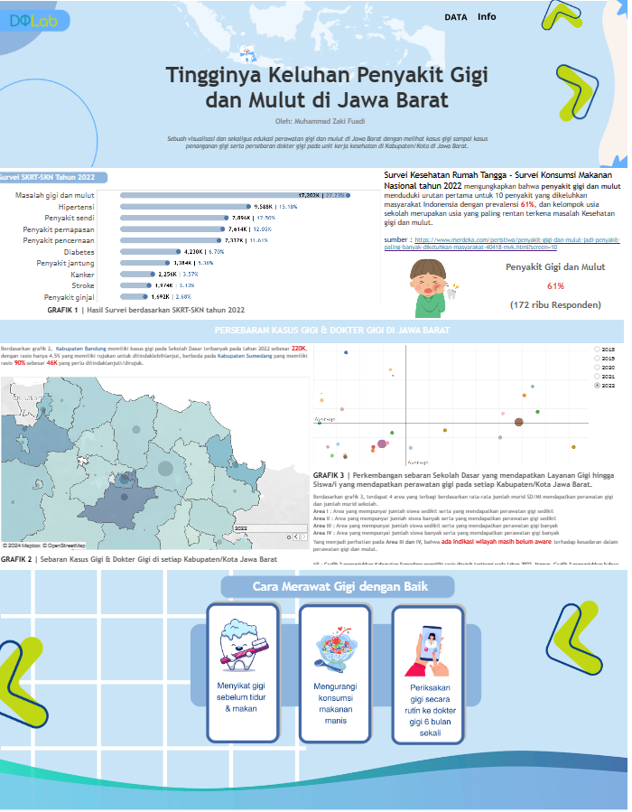

# Capstone TETRIS Batch 4 - TINGGINYA KELUHAN GIGI DAN MULUT DI JAWA BARAT

## Bussiness Understanding

Rendahnya kesadaran tentang pentingnya merawat gigi di usia dini di Jawa Barat memerlukan upaya serius. Kerjasama antara pemerintah, swasta, dan organisasi profesi diperlukan untuk meningkatkan akses dan kualitas layanan kesehatan gigi. Pelatihan tenaga kesehatan dan program edukasi yang efektif juga menjadi kunci dalam mencegah penyakit gigi pada anak-anak. Upaya bersama diharapkan dapat menciptakan generasi muda yang sehat dan berkualitas.

## Goals

Analisa lebih lanjut pada kasus ini untuk meningkatkan kesadaran masyarakat di Jawa Barat tentang pentingnya merawat gigi pada usia dini, dengan fokus mencegah penyakit gigi dan mulut pada anak-anak melalui kerja sama pemerintah, swasta, dan organisasi profesi untuk meningkatkan layanan kesehatan gigi, jumlah tenaga kesehatan terlatih, serta mengembangkan program edukasi yang efektif. Harapannya, hal ini akan menciptakan generasi muda yang sehat dan berkualitas di daerah tersebut

## Data Collection

Sumber data dari profil kesehatan Jawa Barat dari 2018 - 2022 . Dilakukan scraping data pertahunnya.

Mengambil data dari tabel pdf dengan package tabula & camelot

Membagi per informasi yang didapat seperti ;
- Jumlah Dokter Gigi Puskesmas 
- Jumlah Dokter Gigi Rumah Sakit
- Jumlah Dokter Gigi Klinik Perorangan dan Dinas
- Rasio Tenaga Kesehatan / 100ribu penduduk
- Jumlah Layanan Gigi dan Mulut Per-Kabupaten/Kota
- Jumlah Layanan Gigi dan Mulut Pada Anak SD Per-Kabupaten/Kota

Proses Scraping dipisah pertahun pada Jupyter Notebook dan akan digabung kembali pada file ipynb terpisah

## Data Exploration

Data-data pertahun sesuai informasi yang didapat, dikumpulkan dalam sebuah dataset.
Hasil data integration dikumpulkan dalam satu folder.

Beberapa  data eksternal lain seperti data spasial Kabupaten/Kota Jawa Barat, persebaran titik puskesmas & Rumah Sakit di Jawa Barat,  dikumpulkan di folder berbeda dari proses sebelumnya.

- https://gadm.org/data.html
- https://satupeta.jabarprov.go.id/
- https://opendata.jabarprov.go.id/

## Data Cleansing

Menormalisasikan data, karena ada kata-kata yang berbeda namun, memiliki artia yang sama, cara ini dilakukan secara manual.

Terlihat beberapa baris pada kab.kota tertentu masih kosong, maka dengan itu akan direcheck ulang. Beberapa tahap seperti
1. Recheck file pdf terkait
2. Jika masih kosong, recheck profil kesehatan kab/kota terkait di portal dinas kesehatan
3. Jika tidak ada, akan mencari di portal dinas kesehatan kab/kota terkait

Akan dihitung ulang jika ada penemuan data dari langkah-langkah di atas

Beberapa temuan pada laporan profil kesehatan kab/kota
1. #N/A, #VALUE, #DIV/0
2. Data tidak lengkap (tidak ada laporan perihal dataset yang ingin dicari)

## Insights

- Angka kasus penyakit gigi mengalami lonjakan signifikan sebesar 45% pada tahun 2021. Hal ini menegaskan perlunya peningkatan kesadaran akan kesehatan gigi dan mulut.
- Kesehatan gigi dan mulut menduduki peringkat tertinggi sebesar 61% dalam daftar 10 penyakit yang umum dialami masyarakat Indonesia, terutama anak sekolah.
- Proporsi dokter gigi per 100.000 penduduk mengalami penurunan dari 5,1% (2021) menjadi 4,07% (2022) akibat pertumbuhan populasi yang pesat.nga layanan yang tinggi membuat pelanggan enggan menggunakan kartu kredit untuk transaksi besar.
- Kabupaten Bandung mencatat jumlah kasus gigi terbanyak di tingkat Sekolah Dasar pada tahun 2022, mencapai 220 ribu kasus, namun hanya memiliki rasio rujukan sebesar 4.5%.
- Sementara itu, Kabupaten Sumedang mencatat rasio rujukan tertinggi sebesar 90% dengan jumlah kasus mencapai 46 ribu pada tahun 2022.

## Rekomendasi
Rekomendasi untuk Pemerintah Jawa Barat:

- Kampanye kesehatan gigi dan mulut untuk meningkatkan kesadaran.
- Meningkatkan jumlah dokter gigi dengan program pendidikan dan beasiswa.
- Mendistribusikan dokter gigi secara merata di seluruh wilayah.
- Kolaborasi dengan swasta untuk layanan kesehatan gigi terjangkau.
- Tingkatkan kualitas layanan gigi di puskesmas dan rumah sakit pemerintah.

